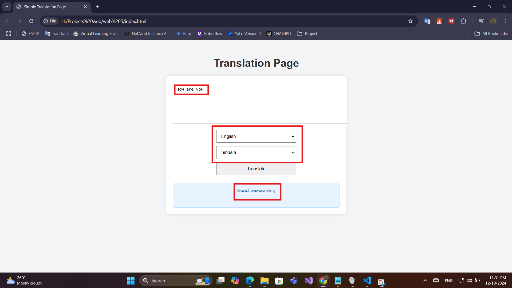
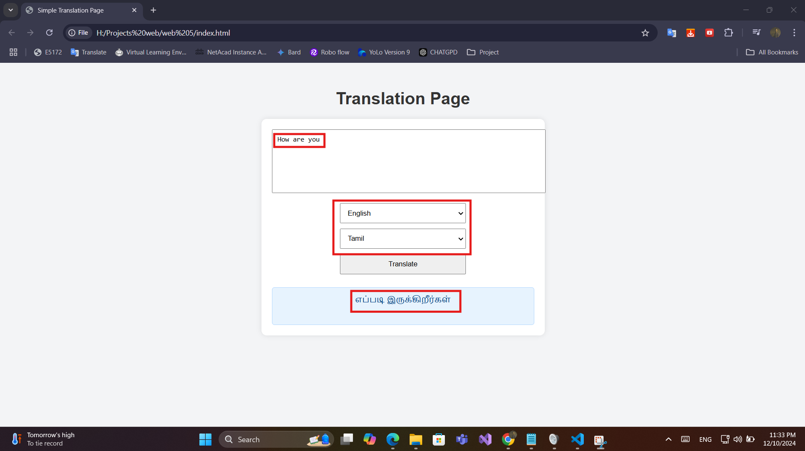

<h1>🌐 Simple Translation Webpage<h1/></h1>
  

  This project is a simple translation webpage that allows users to input text and get real-time translations using the Google Translate API. It mimics basic functionality similar to <a href="google">Google Translate</a>

---

**📋Features**
- Text Input: Enter text you want to translate.
- Language Selection: Choose source and target languages.
- Real-Time Translation: Fetch translations instantly using the Google Translate API.
- Responsive Design: Works on both desktop and mobile devices.
  
---
  
**🛠️ Technologies Used**
- HTML5: For the structure of the webpage.
- CSS3: For styling and layout.
- JavaScript: For dynamic interactions and API integration.
- Google Cloud Translation API: For fetching translations.

---

**📷 Screenshots**
<table>
  <tr>
    <th>Input</th>
    <th>Output</th>
  </tr>
  <tr>
    <td></td>
    <td></td>
  </tr>
</table>
